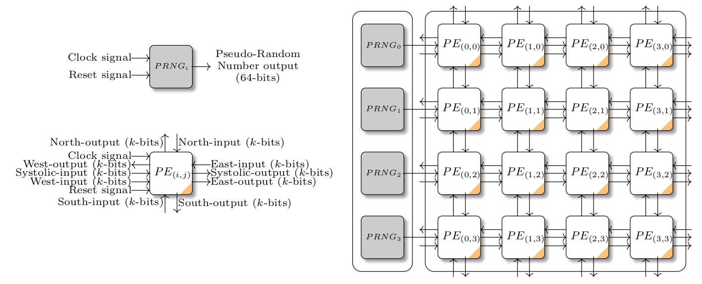

# Hardware Architecture for a 3D Cellular Genetic Algorithm

In many application domains, optimization problems are approached under real-time constraints. Thus, both high algorithmic and processing performance is necessary. Cellular Genetic Algorithms (cGAs) have shown competitive performance when tackling difficult single objective combinatorial and continuous domain problems. Morover, it has been demonstrated that structural properties in cGAs, such as population topology dimension, local neighborhood configuration and ad-hoc selection mechanisms, allow not only further algorithmic improvement but also, these characteristics can be combined at hardware level for acceleration.

The presented hardware architecture explores the idea of multidimensional cellular genetic algorithms presented in:

[1] Alicia Morales-Reyes, Hugo Jair Escalante, Martin Letras, and Rene Cumplido. 2015. **An Empirical Analysis on Dimensionality in Cellular Genetic Algorithms**. *In Proceedings of the 2015 Annual Conference on Genetic and Evolutionary Computation (GECCO '15)*. Association for Computing Machinery, New York, NY, USA, 895–902. (DOI:https://doi.org/10.1145/2739480.2754699)

The proposed hardware architecture emulates a 3D population using a bidimensional set of specialized Processor Elements (PEs). Each PE evolves a sub-population by performing selection, crossover and mutation operators.

## Architecture Overview
The porposed architecture consist of a set of PEs interconnected in a toroidal fashion. Each PE can communicate with a neighborhood composed of PEs located at the north, south, west, and east.

On left there is a column of Pseudo-random number generators (PNRGs) required by the genetic operators. E.g., anisotropic selection requieres a random alpha value for its selection criteria. The PRNGs implements the *Xoroshiro128+* algorithm, for further details refer to: (https://github.com/jorisvr/vhdl_prng).

On the right, the set of PEs interconnected. Each PE shares its chromosome with its neighbors. Chromosome and fitness value are encondes as binary bit strings of length *k* and *l*.
The PE bidimensional array can be customized by the number of columns and rows as well as the number of individuals in the sub-population.

## Testbench

We employed the next testbench composed of three combinatorial and three continuous fitness functions. For combinatorial problems the chromosomes are encoded as binary bit strings. For continuos problems, the chromosomes are enconded as fixed point format.

Problem | Type |Chromosome length (*k*) | Fitness length (*l*) | Input domain
------------ | ---|----------|-----|-------|
rastrigin | continuous|32 |16| [-5.12,5.12]
griewank | continuous|32 |16| [-600,600]
shubert | continuous|32 |16| [-10,10]
isopeaks | combinatorial|32 |  16 | --
mmdp | combinatorial|64 | 16 | --
maxones | combinatorial|32 | 16 | --

## Synthesis

For synthesis, we explored three different configurations of PE array: 2x2, 4x4 and 8x8 processor elements.

*Xilinx Vivado 2016.4* is recommended to synthesis. A Makefile for synthesis is provided. Each target is composed by the name of the problem and the configuration of the PE array. Before running any target, run in a bash console *module load vivado/2016.4*.

**E.g., make rastrigin2x2** will generate a processor element array of 2x2 (4 processor elements), and the fitness function to evaluate will be the rastrigin. 

At the moment, the Makefile only works in Linux, in future releases there will be a compatible Makefile for Windows.
